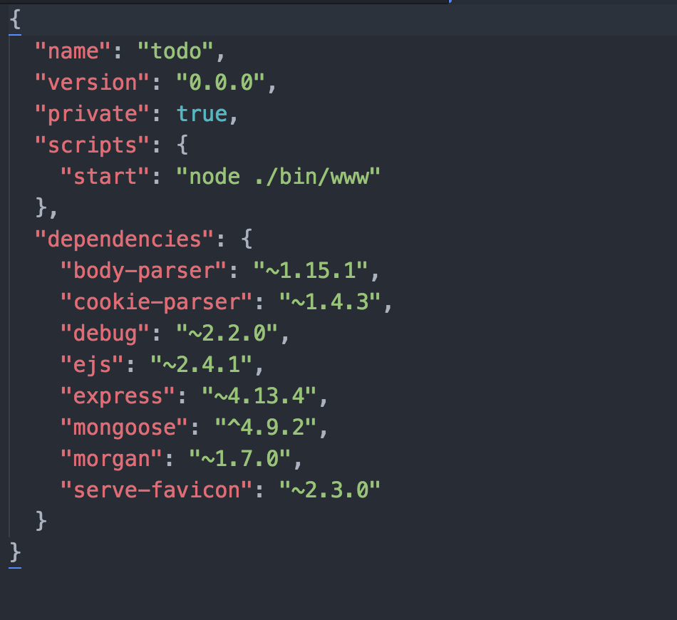
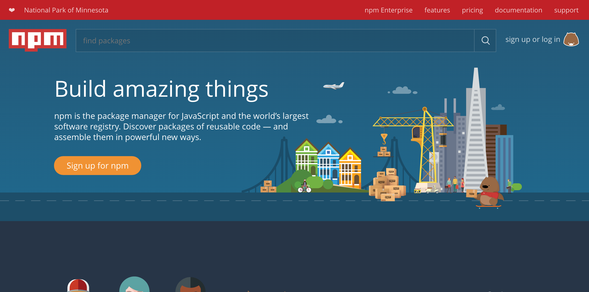
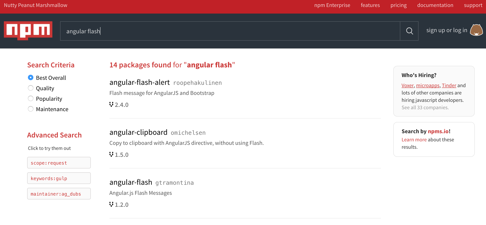
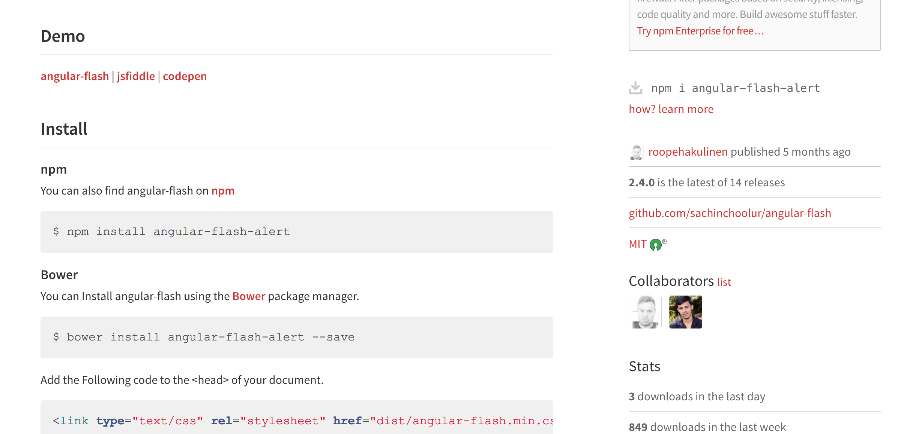

# Packages

One of the most important skills that you will need to build as you continue MEAN Stack Application Development
is finding good and useful packages for various tasks that are lengthy or cumbersome when developed from scratch.

This README consists of four parts:

1. Packages (Overview)
2. How to Find Good Packages
3. How to Use Packages
4. Example of Finding a Package
5. Sample Exercise for todo

## Packages (Overview)

If you codes in C or Java, you may be familiar with libraries that you needed to import in order to give your program
more advanced functionalities. As an example, you may have used used the math.h header to pull in the math library in C
if you wanted to use the power (pow) or cosine (cos) functions.

In the MEAN stack, we can also use libraries to assist with the development of functionalities that are tedious to do from scratch. For example, you might want to read a txt file, send an email, or automate certain tasks.

You have actually seen packages already. The angular-datatables is an example of a package that we have used to create tables without too much work.

So quite simply, a package is simply a library, outside code that someone else has developed that you are bringing into your project.

Sometimes, a package will be super easy to work with. In other times, it may be difficult because certain functions you want are not defined or the behavior of certain functions don't do what you think it's supposed to do.

This brings us to an important point: You should strive to find good packages to use whenever you are handling the development of a big and complex feature.

## How to Find Good Packages

Packages for MEAN stack are handled by the node package manager (NPM). NPM is super useful because it basically pulls in all the packages that your project needs when you start your project.

You used it to start up your local server. But how does it know which packages to pull in. This is described in the package.json file:

Here's an example of the package.json from my todo app:



Notice that we define several json strings along with a json object (more on json in the coming week)

The dependencies object defines all the names of the packages that the project is using. So if take a look, some of these may be familiar. We'll using express for routing and mongoose as our database wrapper. Note that the value for each of these strings is the version of the package that we are using. (More on this in a bit. Keep reading.)

It's very easy to search for packages you want to use. Simply go to the npm website at: <https://www.npmjs.com/>

At the time of this writing, this page looks like this:



You can search for packages using the search box with key terms for the function you are building like "email parser" or "logging in", etc.

There are several items to bear in mind when you find packages to use for the MEAN Stack.

- First, you should make sure that the package solves the problem that you are trying to solve. (Often times, you will find very neat packages doing fancy things that might distract you from your end goal. (Therefore, you should ask yourself: ** Does this package solve the problem that I want to solve?** )
- Second, the package should not be **seemingly** buggy. And there is a caveat here. There's no such thing as perfect code so there's going to be bugs in libraries as well. But the point is that if it is obvious that there are problems or issues with the package, you should develop an inclination that it's probably a bad idea to use it. Here's some things to look for:
    1. If a lot of people are using the package, that's an indication that the package works.
    2. If a lot of people star the packaage, it's also an indication that the package works.
    3. If a lot of issues are raised with the package with little feedback, it's an indication for problem and the red flag should be raised here.
- Third, try to find recent packages because old packages may not be compatible with the project Node or MongoDB version. This is a fairly loose requirement so you have to use your judgment. Obviously, it's a bad idea to use a packages developed in the year 2000, since it's a while back and whoever maintains it probably has moved on. Most of the time, there will be new versions and you should always try to use the most recent stable version.

## How to Use Packages

Using packages can be tricky sometimes. Follow these steps.

For server side packages, you can use npm to bring in the packages into your project.

Go to your terminal where you have the root of your project and run the following command:

```
npm install <name of package> --save
```

Make sure that you include **--save** to add this package to the package.json file so that the application knows to bring in this package for the other developers on your team.

For front-end packages like those that work for angular, you want to bring those in via the cdn. The reference for the package will usually provide the link and you bring them in the same way you import libraries such as Bootstrap and Angular.

## Example of Finding a Package

Let's return to our todo application.

Suppose we want to use a package that will help with presenting flash messages to the user. These are messages that show success when the user has successfully performed an action.

In our application, let's present a flash message when the user add an item to the todolist.

If we search for express flash message, we obtain the following on the npm site:



Notice that the first one debug utility looks promising. If we click on it, we can get more details:



Note that this page gives us installation instructions and also how to use it.

On the right, we see that there are 849 downloads just in the last week! This high volume of usage makes the package a promising one to use. Moreover, we also see that version 2.4.0 is the latest out of 14 releases. This makes it even more promising since more versions means that there is effort to maintain it.

We can include set up this package on our todo app by running the following:

```
npm install angular-flash-alert --save
```

Now let's try using the package by following the usage section of the guide.

You can see that it's quite simple. We can pull in the links and create an angular module followed by defining the html <flash-message> tags.

I'll leave the implementation of this to you.

## Sample Exercise for todo

Create a flash message every time a new task is created. You can start with the todo app from last week's skill.
