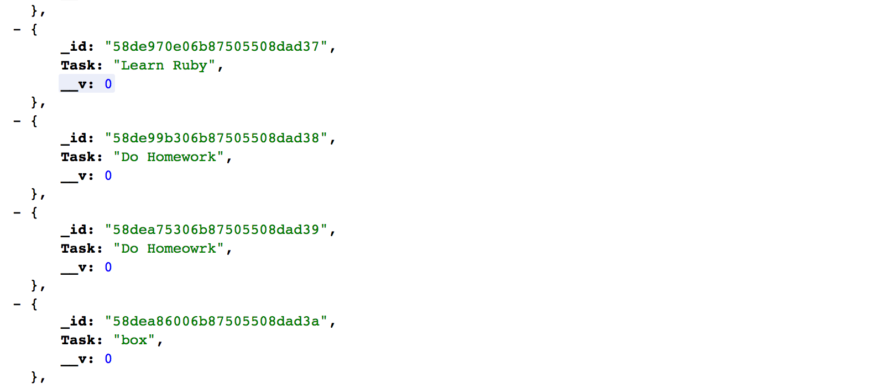

# Data and Services

This week's skill is manipulating data and services in the MEAN Stack Application.

Of course we know that web applications manipulate data all the time.
We generate a lot of data on Facebook when we post to a friend's wall or upload
a new photo. We look at our news feeds and look for our good friends.

Each of these functions perform some action on data. In the case of posting to a friend's wall,
we generate a new data item in the database that Facebook has set up for the application.

This README will provide the following:

1. How Data is Represented in the Application (XML + JSON)
2. Sending and retrieving Data with Express Routing
3. APIs
4. Angular Services
5. Sample Exercise

## How Data is Represented (XML + JSON)

In the good old days, XML was a really popular way of distributing data over the web.

It stands for "e**X**tensible **M**arkup **L**anguage."

To give you an idea of what it looks like, look at the following:

```xml
<students>
    <name>
        Richard
    </name>
    <name>
        Kai
    </name>
    <name>
        Deep
    </name>
</students>
```

Notice that we have tags that contain names of objects we want to store. In this case, we have a students tag which opens the opening of our data where the names of three students are defined. Now, if we wanted to store more fields such as the student's id number, you can guess that we can simply add more tags.

You can imagine that parsing this data is extremely difficult and tedious. Therefore, not too long ago, the web evolved and JSON or **J**ava**S**cript **O**bject **N**otation was introduced.

Now, some more concepts:

1. When exchanging data between a browser and a server, the data can ONLY be text.
2. When we retrieve data from the server to the browser, we can turn that data into a JSON Object to avoid the complexities of parsing a JSON string.

These two points are super important so read these five times before moving on.

Here's a link to the w3schools page for where some of this information is found:
<https://www.w3schools.com/js/js_json_intro.asp>

You should walk through the first 5 parts of JSON to get a solid understanding before moving on.

# Express Routing

One of the most important skills that you must develop is to be able to send and retrieve data in Express Routing.

Let's first talk a bit about retrieving data.

[Recall that we're using mongoose as a wrapper for a lot of the code that we write in terms of manipulating database.]

Let's consider our favorite todo app which I created a new version for this week. Follow along with todo-data.

Now, suppose we want to retrieve all of the tasks that I have added to my database. In other words, I want to fetch this data and look at it in the browser. (Now, as a side note, you have looked at this with RoboMongo, but writing server code to fetch data from your database can actually help you with development in tasks that relate to back-end development.)

The first thing we need to do is create a route. Remember how? We also want a GET route.

```javascript
router.get('/getTasks', function(req, res, next) {

    Task.find(function(err, tasks) {

        if (err)
        {
            return next(err);
        }
        res.json(tasks);

    });

});
```

Here, notice that we are using our model Task and a function find to bring back all the results from that collection.

res.json is function that will send the response as JSON.

Now go to your browser and visit:
/getTasks

You should see JSON output quite messily in black.

Sometimes, I like to look at this output in a better format. To do this, you can download a plugin called JSONView in Google Chrome. Once you download that plugin, you should see output like the following:



Of course, you won't have the same exact tasks. Depending on what you added to your todo app.

Now, for the tricky part. We want to send data to the server. Again we will consider the todo app and look at the example with saving a new task:

```javascript
router.post('/saveTask/:task', function(req, res, next) {

    var newTask = JSON.parse(req.params.task);

    var task = new Task();
    task.save(function(err, task) {
        if (err)
        {
            return next(err);
        }
        res.json(task);

    });

});
```

Notice that in this POST route, we're first using the JSON.parse function to parse the task which is stored in req.param so that we can get a JSON object. You will recall that we send the server a JSON text and so in order to retrieve that data, we can turn it into an object. JSON.parse is the function that does that. I would have a look at the w3schools link if that's not clear.

Notice that once we have that json object, we can go ahead and create a new javascript object and use the data to store a new task. [There's a bug in this code. Did you fix it from the week when we looked at debugging.]

Phew! That was a lot of material. Take a brief pause. I'll introduce APIs in the next section.

## API

Whenever you turn on a lamp, you don't need to worry about how the wires and circuits are connected  together. In this case, the switch on that lamp is your API or **A**pplication **P**rogramming **I**nterface.

While you interact with the switch, a lot of the actions of turning on the light in the lamp is hidden from you. In CS, we call this concept abstraction and it's also relevant when we do web application development.

APIs are everywhere. The Twitter API allows you to fetch tweets about a certain topic, and the GoogleMaps API allows you to display a map and place markers on locations of your choosing. These are examples of interfaces where a lot of implementation details are hidden from you. Rather, you have access to functions that handle a lot of the implementation details.

In general, there are two types of APIs:

1. SOAP
2. REST

### SOAP

SOAP (Simple Object Access Protocol) is a web service access protocol that has been around for a long time.

It uses XML to provide messaging service. One of the strengths of this is that it is "highly extensible." This means that you can use it for a wide range of functions. In general, you define a file called the WSDL which defines how the web service works. There is built in error-handling and you can use it for both HTTP and SMTP.

### REST

REST is the alternative to SOAP since SOAP can be tedious to write.

Instead of XML, REST uses a simple URL. (GET, POST, PUT, DELETE)

Where have you seen this before?

It's easier to work with because you can get the output that you want: JSON, RSS, or CSV.

Refer to this link for more: <http://blog.smartbear.com/apis/understanding-soap-and-rest-basics/>

Now, you might actually be wondering why I am emphasizing this so much. Well, it turns out that you can build little mini-APIs in MEAN Stack Web Applications and they are super helpful in handling a lot of actions that you want to perform. But more on that later. 
