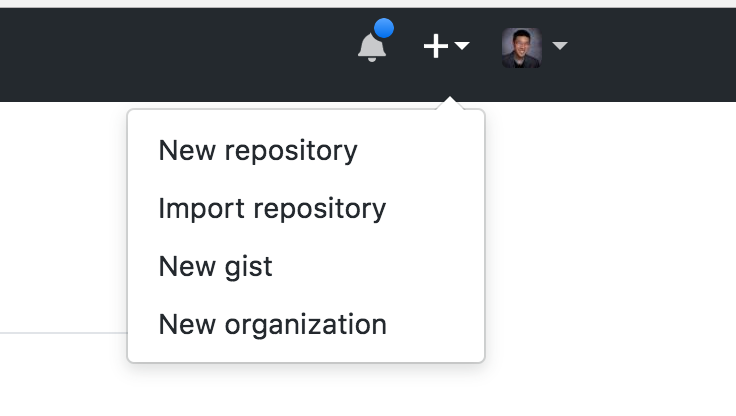
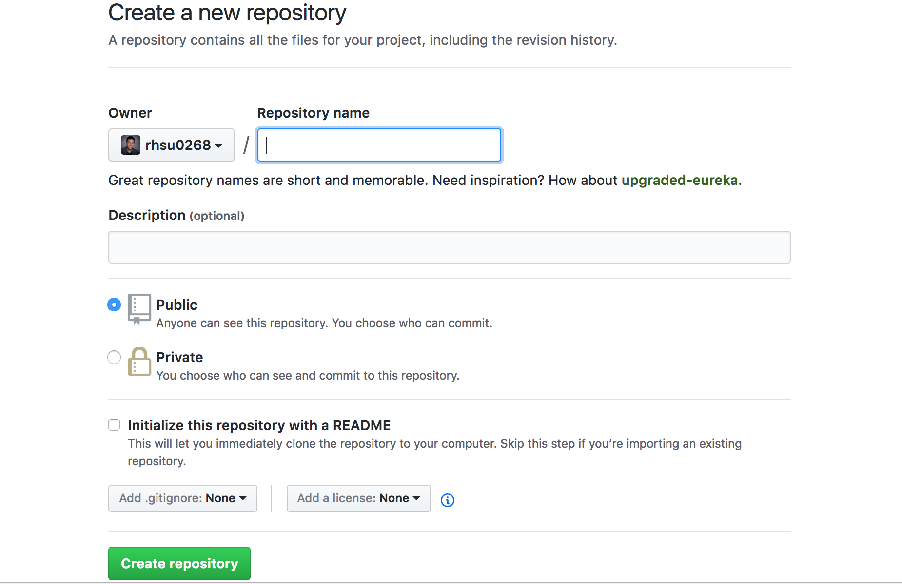
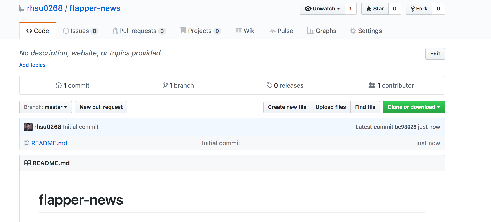

# Git/Github

One of the most important tools that we use in software development is git/github.

Git is a software that manages version control.

Github is the web portal that hosts repositories containing our code.

For the past few weeks, you worked on a simple project from the MEAN stack tutorial.
At this point you should have a firm foundation of the framework.

The next step you need to do is be comfortable working with git and github.

As an exercise, "push" your project to a new repository on github.

To do this, create a new project on github.



Click on New repository.

Give your project a name and an optional description.



Also, I like to initialize my projects with a README which contains information about the project.

You should have a project page that looks like the following:




Now, open up your terminal and cd into a directory where you want to keep your project. You want to run a command to clone down your github project:

```bash
git clone https://github.com/rhsu0268/flapper-news
```

Make sure that you run it with your unique project URL and not mine (or else you'll be cloning my project).

If you do an ls, you should see a new directory called flapper-news. Now, cd into that directory and move your project files into that repo. (app.js, models, routes, etc.)

When you're done, add the files to staging with the following:

```bash
git add --all
```

The --all flag tells git to add all the files to staging. You can do the same command for each of your files and directories but it is a bit tedious.

Next, you want to give your change a commit message. It basically gives you a description of what changes were made or it can even be anything you want. To do this, run the following (be sure to change the commit message though unless you want that as your commit message):

```bash
git commit -m "My super awesome commit"
```

Next, the final step, you should now be able to push your changes to github with the following command:

```bash
git push origin master
```

Congrats! You did it. Now, share that project url with me on Slack so that I know you can successfully do this. 
